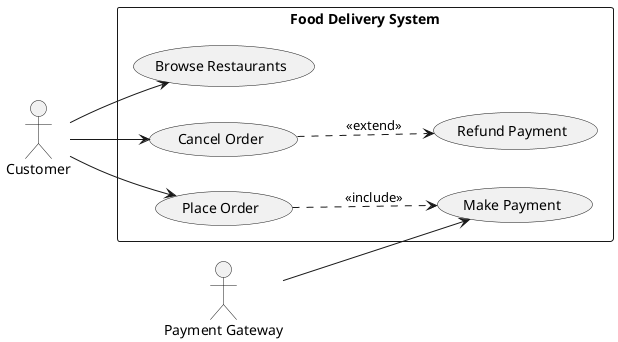

## 6.5 System Boundary

A **System Boundary** defines the scope of the software being designed.

It answers one simple but important question:

> **What is part of our system, and what is outside our system?**

Everything **inside** the boundary represents functionality that our application is responsible for.

Everything **outside** the boundary represents actors interacting with the application.

Think of the system boundary as the walls of your house.

- The rooms inside the house belong to you.
- Visitors remain outside until they enter.
- Your neighbor's house is not your responsibility.

Similarly, a software system should only model responsibilities that belong to it.

### Example

```
                     Customer
                        |
                        |
                        ▼
     +-----------------------------------------+
     |        Food Delivery System             |
     |                                         |
     |   Search Restaurant                     |
     |   Browse Menu                           |
     |   Place Order                           |
     |   Track Delivery                        |
     |   Cancel Order                          |
     +-----------------------------------------+

                Payment Gateway
```

The Customer and Payment Gateway are **outside** the system.

The use cases are **inside** the system.

---

## Why is the System Boundary Important?

Without defining the system boundary:

- Responsibilities become unclear.
- Teams start implementing features that belong to other systems.
- Scope keeps increasing (Scope Creep).
- Integration becomes confusing.

A well-defined system boundary prevents unnecessary complexity.

---

# 7. Relationships

Actors and Use Cases are connected using relationships.

A relationship tells us **how different elements interact**.

There are four primary relationships in Use Case Diagrams:

1. Association
2. Include
3. Extend
4. Generalization

---

# 7.1 Association

An **Association** represents communication between an actor and a use case.

It simply means:

> "This actor participates in this use case."

Association is represented using a **solid line**.

Example:

```
Customer
    |
    |
Place Order
```

The customer interacts with the "Place Order" functionality.

Another example:

```
Admin
   |
Generate Reports
```

There is no ownership, inheritance, or dependency here.

Only interaction.

---

# 7.2 Include Relationship (`<<include>>`)

An **Include Relationship** represents behavior that is **always executed** as part of another use case.

Think of it as mandatory reusable functionality.

Example:

```
Transfer Money

      |

<<include>>

      |

Validate Account
```

Every time money is transferred,

the account **must** be validated.

Validation cannot be skipped.

---

Another example:

```
Place Order

      |

<<include>>

      |

Calculate Total
```

The total amount must always be calculated.

---

Another example:

```
Login

      |

<<include>>

      |

Validate Credentials
```

Credential validation is mandatory.

---

## When Should You Use Include?

Ask yourself:

> **Can the main use case execute without this functionality?**

If the answer is **No**, use `<<include>>`.

---

### Characteristics

- Mandatory
- Always executed
- Promotes reuse
- Shared by multiple use cases

---

# 7.3 Extend Relationship (`<<extend>>`)

An **Extend Relationship** represents optional or conditional behavior.

The main use case can execute successfully without it.

Example:

```
Checkout

      |

<<extend>>

      |

Apply Coupon
```

Applying a coupon is optional.

Checkout still works without it.

---

Another example:

```
Withdraw Cash

      |

<<extend>>

      |

Print Receipt
```

Many ATMs ask:

"Do you want a receipt?"

The withdrawal succeeds regardless.

---

Another example:

```
Book Flight

      |

<<extend>>

      |

Purchase Travel Insurance
```

Travel insurance is optional.

---

## When Should You Use Extend?

Ask yourself:

> **Does this happen only under certain conditions?**

If the answer is **Yes**, use `<<extend>>`.

---

### Characteristics

- Optional
- Conditional
- Executed only when required
- Adds additional behavior

---

# Include vs Extend Decision Tree

```
Does this functionality always execute?

                |
          +-----+------+
          |            |
        YES            NO
          |             |
     <<include>>        |
                        |
          Is it optional or conditional?
                        |
                 +------+------+
                 |             |
               YES             NO
                 |
          <<extend>>
```

Whenever you are confused,

use this decision tree.

---

# 7.4 Generalization

Generalization represents **inheritance**.

One use case is a specialized version of another.

Example:

```
          Make Payment
                ▲
       __________|___________
      |                      |
UPI Payment          Card Payment
```

Both perform payment,

but each has specialized behavior.

---

Another example:

```
Authenticate User
        ▲
        |
--------------------------
|                        |
Login via Google   Login via GitHub
```

---

Generalization can also exist between actors.

Example:

```
          Employee
              ▲
      ________|________
      |               |
Developer         Manager
```

Both are employees,

but each has additional responsibilities.

---

# 8. Relationship Comparison

| Relationship | Purpose | Mandatory? | UML Notation |
|-------------|----------|------------|--------------|
| Association | Interaction between Actor and Use Case | N/A | Solid Line |
| Include | Mandatory reusable functionality | ✅ Yes | Dashed Arrow + `<<include>>` |
| Extend | Optional or conditional functionality | ❌ No | Dashed Arrow + `<<extend>>` |
| Generalization | Specialization / Inheritance | Depends | Hollow Triangle |

---

# 9. Complete UML Example

Consider an Online Food Delivery Application.

### Primary Actors

- Customer
- Restaurant
- Delivery Partner
- Admin

### Secondary Actors

- Payment Gateway
- Notification Service
- Maps Service

### Use Cases

- Register
- Login
- Browse Restaurants
- Search Food
- Add to Cart
- Place Order
- Make Payment
- Track Order
- Cancel Order
- Deliver Order
- Send Notification

A simplified UML representation:

```
                    Customer
                        |
                        |
       +--------------------------------------+
       |      Food Delivery System            |
       |                                      |
       |  Register                            |
       |  Login                               |
       |  Browse Restaurants                  |
       |  Search Food                         |
       |  Add to Cart                         |
       |  Place Order ----------------------+
       |         |                           |
       |         | <<include>>               |
       |         ▼                           |
       |    Make Payment                     |
       |                                     |
       |  Track Order                        |
       |                                     |
       |  Cancel Order                       |
       |         |                           |
       |         | <<extend>>                |
       |         ▼                           |
       |    Refund Payment                   |
       +--------------------------------------+

            Payment Gateway
```

Notice:

- Customer interacts using Association.
- Payment is mandatory (`<<include>>`).
- Refund occurs only when cancellation is allowed (`<<extend>>`).

---

# 10. PlantUML Representation



PlantUML allows engineers to generate professional UML diagrams directly from text and is widely used for maintaining diagrams in version-controlled repositories.

---
---

# Transition to Part 3

By now, you should be comfortable reading and creating Use Case Diagrams.

However, understanding the notation is only one part of software design.

In a real software project, a Use Case Diagram is **not the final deliverable**. It serves as the foundation for subsequent design activities such as identifying business capabilities, defining system modules, designing APIs, discovering domain models, and eventually implementing the solution.

The next part focuses on how software engineers and architects use Use Case Diagrams during the software development lifecycle to transform business requirements into a working system.