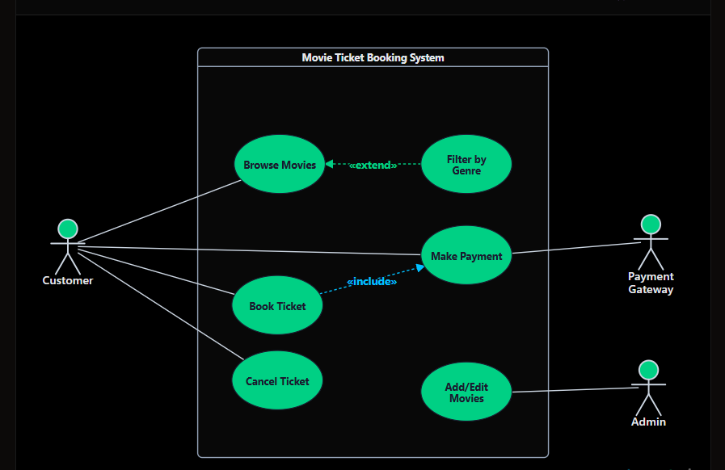

# Part 4 - Implementation

> **Learning Goal:** Learn how to transform a Use Case Diagram into a working software solution. This chapter demonstrates how Use Cases are implemented using UML tools, Java, Spring Boot, and modern software architectures. The focus is not on learning these technologies, but on understanding how a Use Case evolves into a production-ready application.

---

# Introduction

In the previous chapter, we explored how Use Case Diagrams help software engineers analyze business requirements, identify system modules, discover APIs, and design scalable software architectures.

The next logical question is:

> **"How do we implement these designs?"**

A Use Case Diagram is an **analysis artifact**, not an implementation artifact. It describes **what the system should do**, but it does not prescribe **how the system should be built**.

During implementation, software engineers translate these business requirements into code, APIs, databases, services, and infrastructure.

The implementation journey typically looks like this:

```text
Business Requirement
        │
        ▼
Use Case Diagram
        │
        ▼
Software Design
        │
        ▼
Implementation
        │
        ▼
Testing
        │
        ▼
Production
```

This chapter demonstrates how that transformation happens.

---

# 1. Implementing Use Case Diagrams Using UML Tools

The first step is creating a clear and accurate Use Case Diagram.

Common UML tools include:

- draw.io (diagrams.net)
- PlantUML
- Mermaid
- Visual Paradigm
- Lucidchart

## Implementation Steps

1. Identify all external actors.
2. Identify the primary business goals.
3. Create one Use Case for each business capability.
4. Draw the System Boundary.
5. Connect actors using associations.
6. Add Include and Extend relationships where appropriate.
7. Validate the diagram with business stakeholders.

### Best Practices

- Keep diagrams business-focused.
- Avoid implementation details.
- Use meaningful names beginning with verbs.
- Keep the diagram readable.
- Split large systems into multiple diagrams.

---

# 2. Implementing Use Cases in Java

Although Use Cases are business concepts, they naturally influence object-oriented design.

They help identify:

- Service operations
- Business workflows
- Domain objects
- Collaborating classes

## Mapping

| Use Case Concept | Java Representation |
|------------------|---------------------|
| Actor | Client / External System |
| Use Case | Service Method |
| Include | Method Invocation |
| Extend | Conditional Logic |
| Generalization | Interface / Inheritance |

Example

Business Requirement

```text
Customer places an order.
```

↓

Service Operation

```java
public OrderResponse placeOrder(OrderRequest request) {

    validateCustomer();

    validateInventory();

    processPayment();

    saveOrder();

    return response;
}
```

Notice that the Use Case becomes business logic rather than a Java class.

---

# 3. Implementing Use Cases in Spring Boot

Spring Boot provides a natural layered architecture for implementing Use Cases.

Typical flow:

```text
Actor
   │
HTTP Request
   │
   ▼
Controller
   │
   ▼
Service
   │
   ▼
Repository
   │
   ▼
Database
```

Example

```text
Customer

↓

POST /orders

↓

OrderController

↓

OrderService

↓

OrderRepository

↓

Database
```

The Controller receives the request.

The Service implements the business Use Case.

The Repository manages data persistence.

---

# 4. Implementing Use Cases in a Microservice Architecture

As applications grow, business capabilities often become independent microservices.

Example:

```text
Food Delivery Platform

Browse Restaurants
        │
        ▼
Restaurant Service

Place Order
        │
        ▼
Order Service

Make Payment
        │
        ▼
Payment Service

Track Delivery
        │
        ▼
Tracking Service

Send Notification
        │
        ▼
Notification Service
```

Each service owns a specific business capability identified during Use Case analysis.

---

# 5. Event-Driven Implementation

Not every Use Case is executed synchronously.

Some business processes are better implemented using events.

Example

```text
Customer Places Order

        │
        ▼

Order Created Event

        │
 ┌──────┼────────┐
 ▼      ▼        ▼

Inventory

Payment

Notification
```

Technologies commonly used include:

- Kafka
- RabbitMQ
- AWS SQS
- Google Pub/Sub

This approach improves scalability and decouples system components.

---

# 6. Production Example

Consider the following business requirement:

```text
Employer uploads monthly PF contributions.
```

Possible implementation flow:

```text
Employer

↓

Contribution API

↓

Contribution Service

↓

Kafka Event

↓

Spring Batch Processing

↓

Contribution Repository

↓

PostgreSQL

↓

Notification Service
```

A single Use Case can involve multiple services, asynchronous processing, databases, and scheduled jobs before it is fully completed.

---

# 7. Implementation Best Practices

- Keep business logic inside the Service layer.
- Avoid putting business rules inside Controllers.
- Design APIs around business capabilities.
- Keep Use Cases independent wherever possible.
- Use asynchronous communication for long-running tasks.
- Design for scalability from the beginning.
- Keep implementation aligned with the original business requirements.

---

# Key Takeaways

- A Use Case Diagram is an analysis artifact that guides implementation.
- The same Use Case can be implemented using different technologies depending on project requirements.
- Business capabilities often become APIs, services, or microservices.
- Modern implementations may involve REST APIs, messaging systems, databases, caching, and cloud services.
- Good implementation preserves the business intent captured during the analysis phase while remaining scalable, maintainable, and production-ready.

---